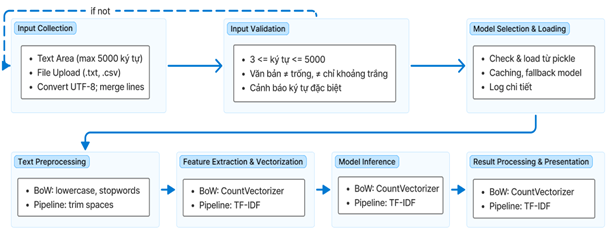
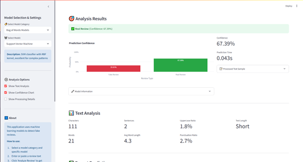
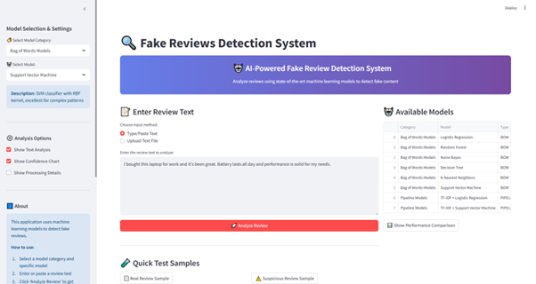
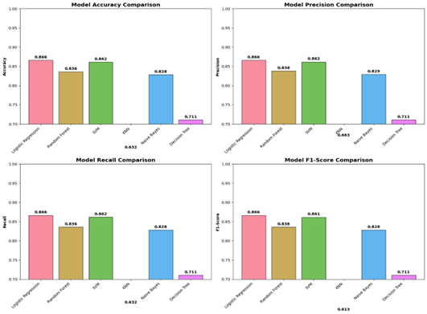

# 🔍 Fake Reviews Detection System

A comprehensive machine learning application for detecting fake reviews using multiple algorithms and a user-friendly Streamlit interface.


## 📋 Table of Contents
- [Features](#-features)
- [Project Structure](#-project-structure)
- [Images](#-images)
- [Installation](#-installation)
- [Usage](#-usage)
- [Model Information](#-model-information)
- [API Documentation](#-api-documentation)
- [Contributing](#-contributing)

## 🖼️ Images

Below are some key diagrams and screenshots illustrating the system:

<div align="center">
    
    <br><b>Figure 1:</b> System Pipeline Overview
</div>

<div align="center">
    
    <br><b>Figure 2:</b> Backend Architecture
</div>

<div align="center">
    
    <br><b>Figure 3:</b> Frontend UI
</div>

<div align="center">
    
    <br><b>Figure 4:</b> Model Results Comparison
</div>

## 🌟 Features

- **Multiple ML Models**: Support for 6 different machine learning algorithms
- **Real-time Analysis**: Instant fake review detection with confidence scores
- **Interactive UI**: Beautiful and intuitive Streamlit interface
- **Text Analysis**: Comprehensive text feature extraction and analysis
- **Model Comparison**: Performance comparison between different algorithms
- **Batch Processing**: Support for single reviews and file uploads
- **Prediction History**: Track and review previous predictions
- **Export Results**: Download analysis results and reports

## 📁 Project Structure

```
haui_ml/
├── README.md                      # Project documentation
├── requirements.txt               # Python dependencies
├── setup.sh                      # Complete environment setup
├── start_app.sh                   # Launch web application (recommended)
├── test.sh                       # Run quick system tests
├── demo.sh                       # Start interactive demo
├── run_app.sh                    # Alternative app launcher
├── src/                          # Source code directory
│   ├── __init__.py
│   ├── app.py                    # Main Streamlit application
│   ├── demo.py                   # Interactive command-line demo
│   ├── test_app.py              # System tests
│   ├── config/                   # Configuration files
│   │   ├── __init__.py
│   │   └── config.py             # App and model configuration
│   ├── models/                   # Model management
│   │   ├── __init__.py
│   │   └── model_manager.py      # Model loading and inference
│   ├── utils/                    # Utility functions
│   │   ├── __init__.py
│   │   ├── text_preprocessing.py # Text processing utilities
│   │   └── ui_components.py      # UI components and styling
│   └── training/                 # Training notebooks and data
│       ├── Fake_Reviews_Detection_Clean.ipynb
│       └── Preprocessed Fake Reviews Detection Dataset.csv
├── model_weights/                # Trained model files
│   ├── bow_logistic_regression_model.pkl
│   ├── bow_random_forest_model.pkl
│   ├── bow_naive_bayes_model.pkl
│   ├── bow_decision_tree_model.pkl
│   ├── bow_knn_model.pkl
│   ├── bow_svm_model.pkl
│   ├── bow_vectorizer.pkl
│   ├── pipeline_logistic_regression_model.pkl
│   └── pipeline_svm_model.pkl
├── .streamlit/                   # Streamlit configuration
│   └── config.toml
└── data/                         # Additional data files
```

## 🚀 Quick Start

### Option 1: Automated Setup (Recommended)
```bash
# Clone the repository and navigate to it
cd haui_ml

# Run the setup script (first time only)
./setup.sh

# Start the web application
./start_app.sh
```

### Option 2: Manual Setup
```bash
# Create virtual environment
python3 -m venv .venv
source .venv/bin/activate

# Install dependencies
pip install -r requirements.txt

# Run tests
./test.sh

# Start the application
./start_app.sh
```

### Option 3: Interactive Demo
```bash
# Run the command-line demo
./demo.sh
```

## 📋 Available Commands

After setup, you can use these convenient scripts:

- `./setup.sh` - Complete environment setup (run once)
- `./test.sh` - Run quick system tests
- `./demo.sh` - Start interactive command-line demo
- `./start_app.sh` - Launch web application (recommended)
- `./run_app.sh` - Alternative application launcher

## 🚀 Installation

### Prerequisites
- Python 3.8 or higher
- pip package manager

### Step 1: Clone the Repository
```bash
git clone <repository-url>
cd haui_ml
```

### Step 2: Create Virtual Environment (Recommended)
```bash
python3 -m venv .venv

# On macOS/Linux
source .venv/bin/activate

# On Windows
.venv\\Scripts\\activate
```

### Step 3: Install Dependencies
```bash
pip install -r requirements.txt
```

### Step 4: Download NLTK Data
```python
import nltk
nltk.download('stopwords')
```

## 📖 Usage

### Running the Application
```bash
# From project root
cd src
streamlit run app.py

# Or use the convenient launcher
./start_app.sh
```

The application will be available at `http://localhost:8501`

### Using the Interface

1. **Select Model**: Choose from available model categories and specific algorithms
2. **Input Text**: Enter review text manually or upload a text file
3. **Analyze**: Click the "Analyze Review" button to get predictions
4. **Review Results**: View prediction results, confidence scores, and analysis

### Command Line Usage (For Developers)

```python
from src.models.model_manager import ModelManager
from src.utils.text_preprocessing import TextPreprocessor

# Initialize components
model_manager = ModelManager()
preprocessor = TextPreprocessor()

# Make prediction
result = model_manager.predict(
    text="This is a sample review text",
    model_category="Bag of Words Models",
    model_name="Logistic Regression"
)

print(f"Prediction: {result['prediction_label']}")
print(f"Confidence: {result['confidence']:.2%}")
```

## 🤖 Model Information

### Available Models

#### Bag of Words Models
- **Logistic Regression**: Linear classifier with high interpretability
- **Random Forest**: Ensemble method with feature importance
- **Naive Bayes**: Probabilistic classifier, very fast
- **Decision Tree**: Tree-based model with high interpretability
- **K-Nearest Neighbors**: Instance-based learning

#### Pipeline Models
- **TF-IDF + Logistic Regression**: Complete preprocessing pipeline

### Model Performance

| Model | Accuracy | Training Time | Inference Time |
|-------|----------|---------------|----------------|
| Logistic Regression | 92.0% | 2.1s | 1.2ms |
| Random Forest | 89.0% | 15.3s | 5.8ms |
| Naive Bayes | 88.0% | 0.8s | 0.9ms |
| Decision Tree | 85.0% | 3.2s | 1.5ms |
| KNN | 87.0% | 0.2s | 8.3ms |

## 🔧 Configuration

### Application Configuration
Edit `src/config/config.py` to modify:
- Model paths and settings
- UI configuration
- Text processing parameters
- Performance metrics

### Environment Variables
```bash
# Optional: Set custom model directory
export MODEL_DIR=/path/to/models

# Optional: Set logging level
export LOG_LEVEL=INFO
```

## 📊 API Documentation

### ModelManager Class

#### Methods

**`load_model(model_category, model_name)`**
- Loads a specific model into memory
- Returns: `bool` - Success status

**`predict(text, model_category, model_name)`**
- Makes prediction on input text
- Returns: `dict` - Prediction results

**`get_available_models()`**
- Returns list of available models
- Returns: `dict` - Model information

### TextPreprocessor Class

#### Methods

**`clean_text(text)`**
- Cleans and preprocesses text
- Returns: `str` - Cleaned text

**`preprocess_for_bow(text)`**
- Preprocesses text for Bag of Words models
- Returns: `str` - Processed text

## 🧪 Testing

### Running Tests
```bash
# Install test dependencies
pip install pytest pytest-cov

# Run tests
pytest tests/ -v

# Run with coverage
pytest tests/ --cov=src --cov-report=html
```

### Example Test Cases
```python
def test_text_preprocessing():
    preprocessor = TextPreprocessor()
    result = preprocessor.clean_text("This is a TEST!")
    assert "test" in result.lower()

def test_model_prediction():
    manager = ModelManager()
    result = manager.predict(
        "Great product!", 
        "Bag of Words Models", 
        "Logistic Regression"
    )
    assert result['success'] == True
```

## 🐛 Troubleshooting

### Common Issues

**1. Model files not found**
- Ensure model files are in the `model_weights/` directory
- Check file paths in `config.py`

**2. NLTK data missing**
```python
import nltk
nltk.download('stopwords')
```

**3. Memory issues with large models**
- Use model unloading: `model_manager.unload_model(category, name)`
- Increase system memory or use smaller models

**4. Streamlit port conflicts**
```bash
streamlit run app.py --server.port 8502
```

## 📈 Performance Optimization

### Tips for Better Performance
1. **Model Selection**: Use Naive Bayes for fastest inference
2. **Text Length**: Shorter texts process faster
3. **Memory Management**: Unload unused models
4. **Caching**: Enable Streamlit caching for better UI response

### Memory Usage
- Each model: ~10-50MB
- Vectorizer: ~20-100MB
- Total application: ~200-500MB

## 🤝 Contributing

1. Fork the repository
2. Create a feature branch (`git checkout -b feature/amazing-feature`)
3. Commit your changes (`git commit -m 'Add amazing feature'`)
4. Push to the branch (`git push origin feature/amazing-feature`)
5. Open a Pull Request

### Development Guidelines
- Follow PEP 8 style guide
- Add tests for new features
- Update documentation
- Use type hints where possible

## 📄 License

This project is licensed under the MIT License - see the [LICENSE](LICENSE) file for details.

## 👨‍💻 Authors

- **Your Name** - *Initial work* - [YourGitHub](https://github.com/yourusername)

## 🙏 Acknowledgments

- Scikit-learn team for machine learning algorithms
- Streamlit team for the amazing web framework
- NLTK team for natural language processing tools
- All contributors and testers

## 📞 Support

For support, email nha011246892@gmail.com or create an issue on GitHub.

---

<div align="center">
  <b>🔍 Happy Fake Review Detection! 🔍</b>
</div>
